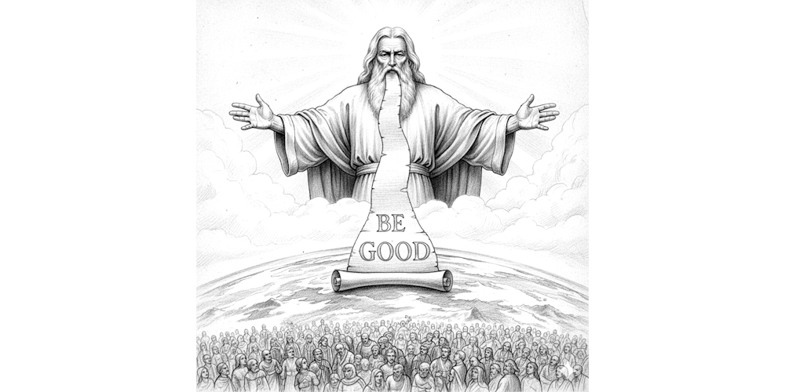
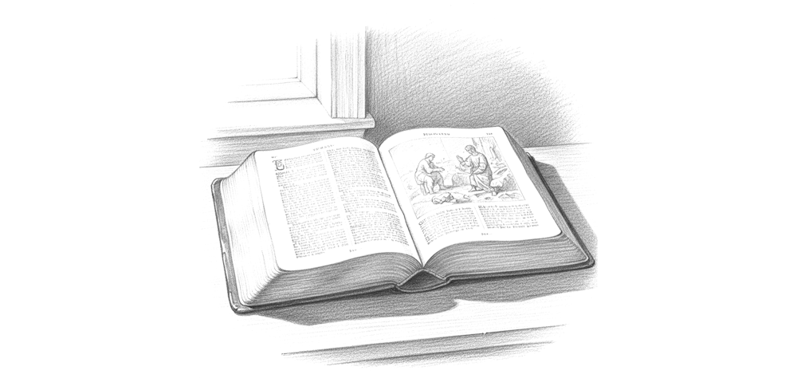

# Biblical Morality

Theists in general agree that morals must be objective, and they see these morals coming from God.

:::tip

Bob feeds the orphans. This is a good act because God commands us to take care of vulnerable children. Sam does not feed the orphans.  This is bad for the same reason.   If God had not commanded this, the act of feeding orphans would be neither good nor bad.

:::

## Moral Foundation Needed

Christians rightly argue that without objective morality, there can be no basis for talking about what one should and should not do.  If my morals can be different from your morals, then anything I do is right, and anything you do is right as well.  

If everybody can claim that sea level is defined by whatever level they are at, it becomes very difficult to talk about the altitude difference between two people: both are at sea level, even if one is thousands of feet higher.

## Divine Command Theory

While theists may be right about the need and existence of universal moral truths, they make a simplistic assumption about the source:  they say that God must have simply created them, along with everything else that God created in the world.

It has been that pattern in all primitive cultures that when those people can not imagine the source of something, when they can not understand how they form, they then simply conclude that something must have made it.  Since the making of such things are inconceivably hard, they assume the maximally powerful being would be needed, and there is only one of those: God.

## Knowability of God's Truths

The bible itself is inconsistent about moral advice.

* Slavery, now regarded as evil, was accepted by the writers of the bible as normal behavior
* Food illnesses caused various taboos that are no longer relevant since germ theory was discovered
* Practices around dealing with leprosy and other diseases were often harmful
* The old testament is filled with stories of holy genocide.  The early tribes of Israel were in fact warring tribes, and the myths of a bible are clearly meant to motivate the population to do the will of the warlord.  How can the destruction of the Amalekites possibly be considered moral?

Mature Christians don't claim that morality comes from the bible, but that God's morality was written on the hearts of men, atheist and theist alike.  We know right from wrong, and you have a choice in following.

## Righteous Arrogance

While it is good that Christians aspire to be moral, the insistence that they are the only possible moral actors in the world does a deep disservice to the hundreds of other traditions that are equally moral.  And history has no shown Christians to be any more moral than any other major world culture. 

Christians seem to be blind to the good actors that are around them, even going so far as to claim that non-Christians are simply accidentally acting on Christian sourced principles without knowing it.

## Lawgiver is Unnecessary

Thinking that moral truths must be invented by a God is as silly as thinking that boat design truths must be invented by God.  The fact is that these truths are true because they work, and not because of any divine manufacture.

This view on morality completely eliminates the Euthyphro Dilemma: Good actions are not good because God commands them, but instead they are good because they work to the success of the actors.

## Questions

> "Here's a question for those who deny God: If you don’t believe in absolute truth, on what basis do you condemn bearing false witness? According to God’s standard, false witnesses are accountable and deserve justice (Deuteronomy 19:18-19). But in a worldview without God, where morality is subjective, isn’t lying just another choice? So, what’s your basis for condemning it—personal preference?"

Banning lies has a beneficial effect on the society that bans them. People in that society live longer, live better, and survive to produce more offspring.

A society that says it is OK to lie will die out. It is as simply as that: allowing lies is evil for this reason. Banning lies is good for this reason.

No god is needed.  Morality is not subjective. 

## What Christians Say about Others

> “In a world without God, there can be no objective right and wrong, only our culturally and personally relative, subjective judgments. This means that it is impossible to condemn war, oppression, or crime as evil. Nor can one praise brotherhood, equality, and love as good. For in a universe without God, good and evil do not exist—there is only the bare valueless fact of existence, and there is no one to say you are right and I am wrong.”
> -- William Lane Craig, [‘The Absurdity of Life without God’, TheHuffingtonPost.com, 18 Dec 2013](https://www.reasonablefaith.org/writings/popular-writings/existence-nature-of-god/the-absurdity-of-life-without-god/)

Even without God, we can appeal to something outside of our ‘culturally and personally relative, subjective judgments’.

> “. . . this indignation is perfectly groundless if we ourselves regard morality as a subjective sentiment to be altered at will. Unless there is some objective standard of good, overarching Germans, Japanese, and ourselves alike whether any of us obey it or no, then of course the Germans are as competent to create their ideology as we are to create ours.”
> -- C. S. Lewis, ‘The Poison of Subjectivism’, Christian Reflections

Moral objectivity requires forgetting nationality; thinking impartially. E.g.: Universal Declaration of Human Rights (UDHR).

> “A good atheist — that is, a consistent atheist — recognizes this dilemma. His only reasonable conclusion is to reject objective meaning and morality. Thus, calling him “good” in the moral sense is nonsensical. There is no morally good atheist, because there really is no objective morality. At best, morality is the mass delusion shared by humanity, protecting us from the cold sting of despair.”
> -- Pastor Rick Henderson, [‘Why There Is No Such Thing as a Good Atheist’](https://www.huffpost.com/entry/why-there-is-no-such-thing-as-a-good-atheist_b_4442287)

Our ability to think impartially is not ‘mass delusion’. Taking a moral stance means adopting a non-partisan attitude.

## Sundry

Frank Turek said:  “the only reason I know what was good is because there's a standard of good outside myself, and that's God's nature."

Turek continued, "As soon as we see something evil, we know it's evil."
 
The important thing to know here is that Turek does not say that he knows the difference between good and evil because of the Bible. The Bible is not a manual on morality. The Bible mentions behavior, which is good and bad.

Take for example marriage. Most Christians will insist that a proper moral marriage is one man and one woman. But King David is a very important person in the Old Testament, and he had 13 wives. Ask the Christian if King David was a moral person, or if his Marriages were moral. An honest Christian will say no. One must than wonder why the Bible spends so much time telling a story about such an immoral person. 

Turk does not fall into that trap.  We need to pay special attention. The deep thinking Christians that I know don’t claim that the Bible is the source of mortality, but that we know morality. In other words, they say that God created it and wrote it on our hearts. That will also admit that Christians and atheist alike have the same morals written on your hearts. That’s what gives them the arrogance to claim that atheist are ignoring the morals of God, which they know through this mechanism. 

Also, it’s odd that Turek credits the nature of God with the source of these moral guidelines. He’s not saying that God decided that ex is moral and why is immoral, but rather God had no choice in this. It comes from God‘s nature means that The way God is reflects the morality of the universe. 

An atheist doesn’t see it much different than this. The nature of God is the nature of the universe. There can be no difference. Even for a Christian, they understand that if God has a nature, then clearly the universe he creates will have that nature as well, or lease will be created according to that nature.

Atheist recognize that the universe has a nature. There is a certain way that the universe is. We talk about physical laws, and we understand that there are facts about the universe which reflect the nature of the universe. There’s no functional difference between the nature of the universe and the nature of God, other than the Christian believes that there’s some sort of intelligence there while the atheist believes that that nature exists without anything like a human intelligence.

So if we believe that morals are in fact from the nature of the universe, then there’s not that much difference between the atheist and Frank Turek.

We might also have a discussion of what it means to be intelligent. If intelligence is the ability to make the decisions, then can’t we say that evolution itself is intelligent. I’m not saying that there is an intelligence behind evolution that steps in and makes decisions, but rather the process of evolution itself Forms a decision making mechanism. That is evolution, decides on the better animal by simply creating all possible animals and killing the ones that aren’t the best. That may not strike you immediately yes being in intelligence, but the more we learn about human intelligence the more we find that that’s pretty much what humans do. We imagine a set of possible future scenarios, and then we eliminate those scenarios which appeared to have a bad outcome. Ultimately, we pick the scenario that we think is going to be best. It’s a kind of an evolution of ideas.  

The same question might be asked about the trait of creativity. A creative person will start with some sort of brainstorming about what is possible and then eliminate those things that either can’t be done or don’t work out. Creative person has no control over the ideas that occur to them initially. There’s a lot of exercises one can do to try to increase the number of possible opportunities that you think of, but at the end of the day, an idea either comes to you or it doesn’t. From that point on it’s a matter of selecting the best, putting these ideas to some sort of competition, and then choosing. Can’t one say that evolution is creative in the same way? Again, I’m not suggesting that evolution has thought processes and has some sort of a mental place where these ideas are sort out. Clearly, I’m talking about simply creating all of the forms that can be created, and then ultimately selecting the best ones. 