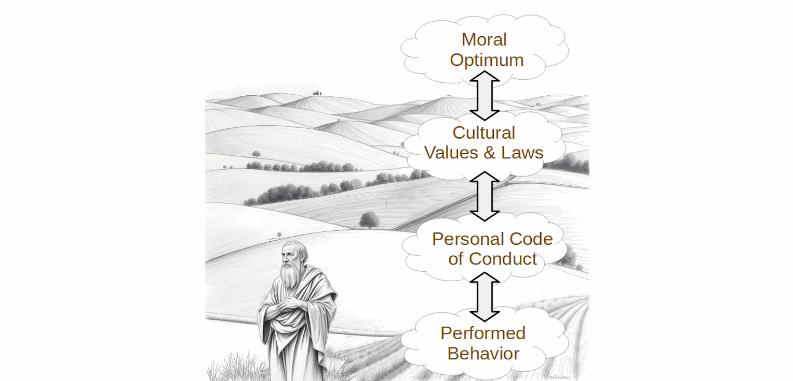

# Terms of Discussion

We start with some definitions of terms, none of which are intended to be controversial.  In this work I will use these terms in these ways.

**good/right** - Good has many meanings, but we will stick to the meaning of morally good.  Actions, qualities, or principles are morally good when they are considered right, virtuous, benevolent, and beneficial.  Doing the right thing, is to act morally good.  Such as being kind to people is morally good.  Instead of saying something is physically good for you, we can use the term beneficial.  So that there is no confusion, if something feels good, we will call it pleasurable.  If something tastes good, we will call it delectable.  Instead of saying that the student picked the right answer, we will use the term correct answer.

**bad/evil/wrong** - We will use these words interchangeably to mean simply morally bad, the opposite of morally good.  The word 'evil' will not necessarily used to mean profoundly bad, but just the action is not morally good.  Instead of saying that the student picked the wrong answer, we will use the term incorrect answer.  If I use the term 'sin' it will mean the same as a bad or evil action.  

**good life/eudaimonia** - means a morally good life, a life where the actions you make are morally good, but at the same time quite possibly be beneficial for you and your tribe.  The good life is a life where you make all the best decisions along the way so that you always maintain what Aristotle calls the golden mean where you neither sacrifice too much, nor do you squander too much.  It is a life with neither excess nor deficiency.  

## Morality vs. Ethics

Morality and ethics are guidelines for finding the good life.  I won't be giving you any specific guidelines, but instead discussing how these guidelines have come about and the reason why we should be able to trust them.  There is a subtle difference between these terms:

**Morals** - Refers to personal beliefs about right and wrong, often shaped by cultural, religious, or personal values. They are more subjective and can vary greatly between individuals and societies.

**Ethics** - Refers to systematic rules or principles governing conduct, often established by professional organizations, institutions, or societies. Ethics are more objective and provide a framework for making decisions in various contexts.

**Morality** - Refers to the idea that specific actions can be identified as either leading towared or away from the good life.  We attempt to identify whether an action is good or bad through the use of moral rules (which are simplistic approximations) or moral guidelines (which more complete yet often intractible).

**Moral Optimum** - Refers to the idea that there could be a moral guideline that describes the best way to behave across any given context.  Simply put: for any given situation, from the set of all possible actions, there is a best action to choose.  Nobody knows the moral optimum for sure, but we strive to approximate this optimum as best we can.

## Morals in Action

Morality is concerned with distinguishing what is right from what is wrong; good actions from evil actions; sin from virtue.  In all cases we are talking about *conduct* which is a set of actions that an agent does.  Here are some definitions of morality from dictionaries:  

*   a doctrine or system of moral conduct
*   conformity to ideals of right human conduct
*   The quality of being in accord with standards of right or good conduct
*   A system or collection of ideas of right and wrong conduct

**Acts/Actions** - are things a person might decide to perform.  Everything that we actually do is composed of actions.  Morality, simply put, is a way to distinguish good actions (those which you should do) from bad actions (those which you should not do).  Note that the term _should_ is used simply to connote that an action is good.  The morality of an action is only important if someone can decide whether to do it or not.

**Context** - The morality of an action depends not only on the act itself, but also the context which is the situation around the action and everyone who was involved.  Starting a fire in a campsite fireplace is probably a good action, starting a fire in a crowded airplane definitely a bad action.   The entire situation must be considered when assessing the morality of an action.

**Agent** - is the person deciding to do the action.  I will use this interchangeably with person, but they are not always equivalent.

**Tribe** - I will use this term for any group of individuals trying to work together.  Today tribe can mean many things: your community, your city, your school, your family, your nation, etc.  To keep from having to spell these different grouping in every occasion, tribe will be used to mean a collection of people working together at any scale.

**Subjective** - is about things defined within the mind in relation to perceptions which might be unique to each individual subject:

*   characteristic of or belonging to reality as perceived rather than as independent of mind
*   relating to or being experience or knowledge as conditioned by personal mental characteristics or states
*   peculiar to a particular individual
*   arising out of or identified by means of one’s perception of one’s own states and processes
*   Not caused by external stimuli.
*   Dependent on or taking place in a person’s mind rather than the external world.

We will spend a lot of time exploring what it means for morals to be subjective but it is clear that anything that is subjective is something that is unique to that person and possibly only knowable by that person.  Your feelings are subjective because nobody else can feel them.

**Objective** - is about things that are outside of an individual mind, and can be observed by any number of people the same way:

*   expressing or dealing with facts or conditions as perceived without distortion by personal feelings, prejudices, or interpretations
*   having reality independent of the mind
*   involving or deriving from sense perception or experience with actual objects, conditions, or phenomena
*   not influenced by personal feelings, interpretations, or prejudice; based on facts; unbiased
*   intent upon or dealing with things external to the mind rather than with thoughts or feelings

## Layers and Scope

To be able to talk about morals clearly, we need to distinguish between the multiple layers and scope of morals.  Much of the confusion in discussions of morality often have to do with 

 

**Moral Optimum** - This is the ultimate valuation of whether a specific action was actually good or bad.  These are objective, however people might disagree on what is and is not the optimum action because of differing understanding.  These apply universally across space and time however different actions might be optimum at different places and times.  A moral guideline that approaches the moral optimum will be extremely complex in order to account for all the possible extenuating circumstances.

**Cultural Values & Laws** - Cultures will embody statements about what is and is not good, usually expressed as a rule to follow.  Some of these are formally written and adopted as laws.  Moral rules and laws are different degrees of the same thing: they both encourage (or enforce) behavior which is considered to be good.  Some cultural values are less explicit, and appear only as guidelines or simply a shared idea among the participants of the culture.  Laws exist from local, to community, to city, to state, to country, and somethings the whole world.  Laws will occasionally conflict with each other.  Because these are rules, they only approximate the real moral valence.  The term **ethics** generally plays at this level.

**Personal Code of Conduct** - A set of rules that an individual claims or aspires to live by.  These are largely adopted from the culture, but an individual does not always agree with their culture, especially when they find themselves in a multi-cultural situation where the individual might have to chose between two conflicting rules.  These must be expressed as rules.  It would be the set of rules that an individual would claim to follow if they could.  That set is limited to what a person can remember and internalize.  The term **morals** generally plays at this level, when we talk about an individual having good morals or bad morals.  Notice that comparing morals at this level implies some higher level morality to compare various morals.

**Performed Actions** - What an individual actually does. People follow their own rules most of the time, but sometimes it is too much trouble and shortcuts are taken. The actions are the true measure of what an individuals thinks is good or bad, and they are somewhat more pragmatic than the explicitly stated rules. 

There is a tension between the bottom two as people try to put their own morals into action.  Most people have an internalized code of conduct.  They may have an intuitive understanding of right and wrong that transcends the rules they claim to follow.  That is, there might be an explicit rule to turn someone in for a crime, however one might allow someone to get away because for some reason they did not deserve it.  There may not be an explicit rule to cover the situation, however rules conflict in their detail, and one must use judgement in selecting which rules apply to which situation.  

There is a tension between the personal code of conduct and the cultural values and laws.  Most laws represent the morals of a culture in a written form. But in the case of an unjust law, it can be moral to show civil disobedience when the law can be shown to contradict other recognized moral rules.  Your personal code of conduct may override the laws or cultural norms.

Sometimes a minority group embedded in a larger culture may be faced with conflicting rules they need to choose between.  In this case the individual has to choose which cultural rules to follow, and which rules to breach.  Again, the personal morals must guide that decision.

Finally it is also possible there is a tension between the top two.  A culture may adopt practices it views as moral but in fact turn out to be immoral.  Two examples: bloodletting and slavery.

