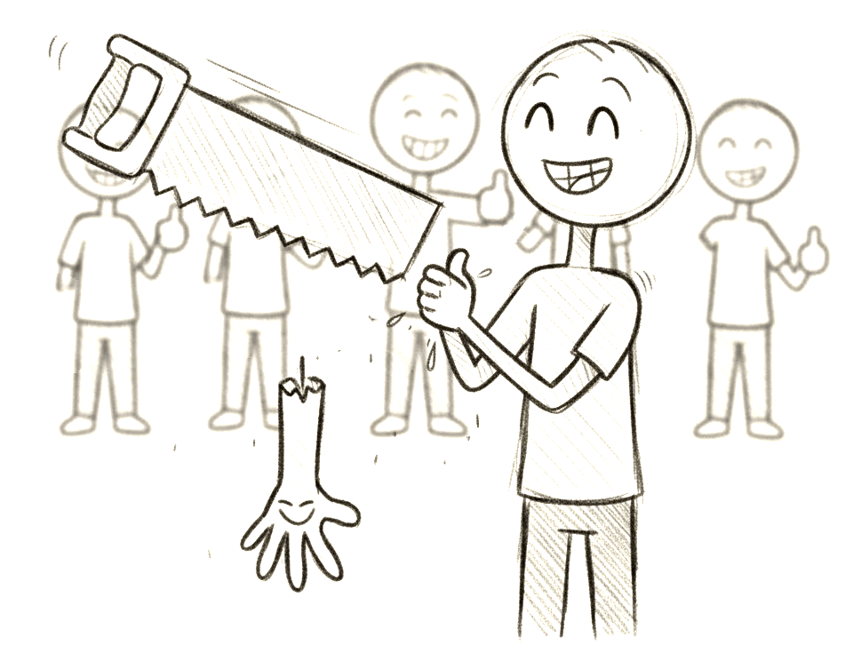

# Parable of the Hand Choppers

:::tip[Key Takeaway]

A law passed to remove everyone's right hand would be an immoral law, even if everyone agreed to it and believed it to be moral.

:::

## Situation

Imagine a tribe or a culture which for some unusual reason decided that it would be a good thing for everybody to chop off their right hands. Of course this tribe is insane because we all intuitively know that this is a very bad idea. But let's set that aside for a moment.  

The tribe gets together and comes to a unanimous agreement that all right hands should be removed.  They are removed surgically under anesthesia and the wound is healed without pain.  There is no suffering from the hand removal process.  The right hand is just cleanly removed.

## Moral Assessment

**Is this law good or bad?**

The consequence of removing everyone's right hand would be disastrous for the tribe.  There are many jobs that require two hands. It would be impossible to carry larger objects.  Chopping food requires a hand to hold the food, and the other to hold the knife.  The inability to get common everyday things done might escalate to the point of some people dying.  Imagine an able-bodied tribe next door, would certainly out-compete in every economic activity, not to mention obviously beating them in any kind of battle.

Because this law seriously endangers the survival of the tribe, and the people within it, we can say assuredly that this law is bad.  It is an objectively immoral law.

## Subjective Morals Can Not Explain This

Remember that everyone in the tribe wanted this law and thought it was good.  If morals were _subjective_, that would be the end of the story: the law would be good because everyone thought it was good.  

We can ask the question of whether a law is moral or not because in fact morality means more  than just what people believe about the situation.  There is a real consequence to having that law.  The law dramatically causes harm to the tribe.  It is that harm that makes the law evil, and that harm is as objectively measurable as anything.

You see, it does not matter at all that everyone in the tribe thought it would be good.  The law is objectively bad, and no amount of believing differently will change that.  True morality can not be subjective, because our subjective opinions do not dictate the consequences of the action.

## Questions

> What if there was a virus that only infected the right hand, and was 100% fatal if the hand was not chopped off.

Here we see an attempt by someone to define a special case whereby the action of chopping off the hand would be good.  I don't need to point out that there is no virus like that described, and it is exceedingly unlikely to ever exist with that peculiar set of symptoms.  So it is a completely unrealistic hypothetical.

The point about making any scenarios is that you specify the relevant details, and whatever is omitted from the description is presumed to be "normal".  Such a virus is far from normal.  This question is posing an entirely different hypothetical.

It is worth pointing out that morals are situational.  Lighting a fire in a fireplace is fine, lighting a fire on a crowded passenger jet while flying is not good.  We can not divorce the action from the situation.  One can not make a general claim about the morality of lighting fires and expect that to extend equally to all situations.

The situation in the parable is that the law was passed, and there is no such virus or anything else unusual about the situation that would make hand chopping good.  Stick to the situation as it was presented.