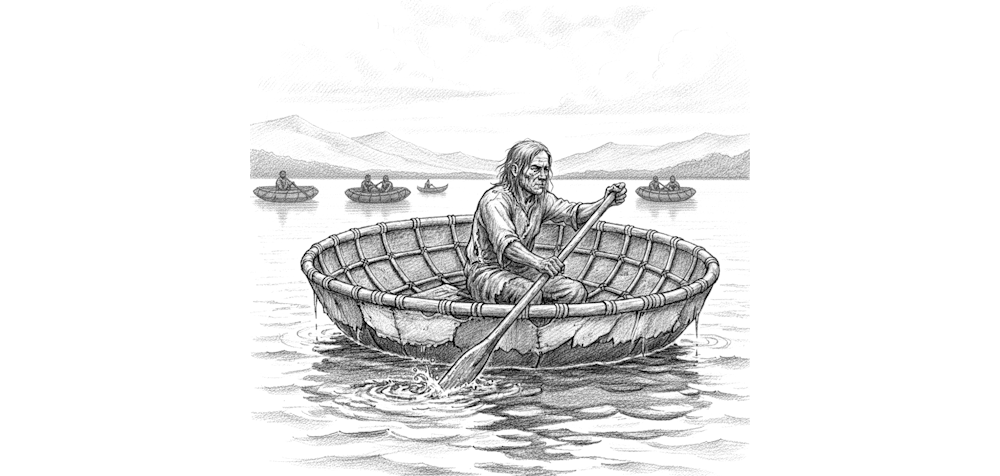
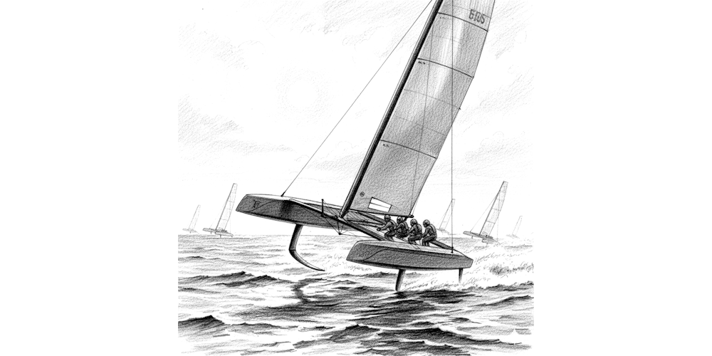

# Objective Truths

How can there be truths that come about in a natural way?  Do they just randomly appear out of nothing?

These are the kind of questions that theists ask when they are convinced that God created moral truths, and they can't see how such truths could form naturally.  In this chapter I hope to let you see that such truths are not surprising and would naturally fall out of any situation where such a difference would matter.

## Boat Design Analogy

Is there an objective truth about the design of boats, and if so, who created those truths?

Consider the ancient coracle boat which is the simplest boat possible and it is a design that was created by humans 100,000 years ago.  One can imagine ancient humans running a competition to see who, among a field of such boats, could get to the finish line the fastest.

As time went on, boat design advanced in many ways and with many materials.  Each advance made a boat that was objectively better up to the fastest sailing boats that humans have ever made: the Americas Cup winners.  Through trial and testing of many different design options, boat makers found out what worked and what does not work as far as making a sailing boat go fast.  The monohull gave way to the catamaran.  Carbon fiber replaced wood.  Tall sails were found more effective than wide sails.  Etc.

Of course different designs will be optimal for different purposes.  If you need to transport a large amount of oil from one continent to another, then a very different design will be optimal.  The design is related to the purpose, but an optimal design can be said to exist for any purpose.

The point is that there are objective truths about boat design.  Some design patterns are better than others.  Who invented these truths?

Nobody invented the truths about good boat design.  The particular optimal design for a sailing both simply comes from the properties of water, from the strength of gravity on earth, and on the details of the atmosphere and weather the boat needs to sail in.  These truths about boat design exist without anyone creating them.

## Dog Morality

Dog have moral truths as well.  There is a kind of dog morality that helps the pack function.  Some of these are so obvious; for example a dog does not kill another dog in the pack, that is, murder is not allowed.  Not all animals do this.   Dog have specific rules about eating.  Dogs respect property rights; they don't steal things that other dogs own.

Dogs are social animals that need to cooperate to survive.  They have to work together.  That means there has to be rules about how they interact.  These rules are either instinctual or taught from parent to pup.  If they are taught, then how did this ability to teach and to learn moral rules develop?

The fact of the matter is that there is a moral truth about the optimum way for dogs to behave together.  There are ways of acting that work for the betterment of the pack, and there are ways that harm the pack. Who invented those?  Nobody/nothing invented them.  

The optimal way for a dog to act for the betterment of the pack (and ultimately themselves) is a consequence of the form of the dog and the environment they live in.  Approximations to the optimal were found by trial and error.  Dogs that behaved closer to the optimal, survived better.  Those that behaved further from the optimal tended to die out.  Thus the more optimal dogs survived, and that is why dogs behave as they do.

## Human Morality Too

Objective truths in any category do not need to be created by anyone or any thing.  They are simply a consequence of physicality.  There is always a best way to do something.

Behaviors, like those of human societies, will tend to approach these optimums if the behavior matters for survival, and if the behavior can be transmitted from generation to generation.  This is an evolutionary process.

Humans must work together to survive, and the better they work, the better they survive.  The bad actions are lost when the actors die.