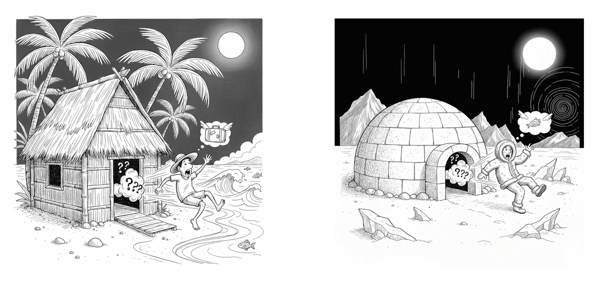
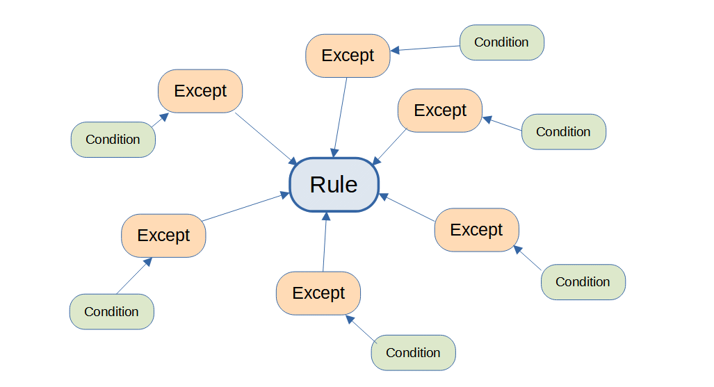

# Moral Rules are Inadequate

We often discuss morality in terms of "rules to live by.". In this chapter I want to make a distinction between the logic that guides moral behavior, and the rules that we use when discussing what should and should not be done.

## Rules are Simple

Rules are short simple statements to guide behavior.  Some example rules are:

* Don't lie
* Don't steal
* Don't break windows or otherwise damage someone else's property
* Do help feed orphans

Those rules are stated in imperative form, but we can also state them in evalutative form which is useful for assessing the morality of behaviors:

* lying is bad
* stealing is bad
* breaking windows and damaging other's property is bad
* helping to feed orphans is good

The thing to note about rules is that they are short and simple. Their brevity makes them useful.  Rules can be said quickly, and they communicate a great deal of value in guiding behavior.  They can be used as a rough guide for behavior for a large variety of situations.  For example: don't enter that room.  Or, don't touch the wires.  Always close the door behind you.  There could be many good reasons to avoid or promote these behaviors, but listing out all those reasons is tedious and time consuming.  Giving a short rule might be all you need to know to act morally most of the time.

## Slicing Actions Apart

The swirl of motion in the universe needs to be broken into separate identifiable repeatable patterns which we name in order to talk about them.  The way to divide motion into patterns is somewhat arbitrary.  The way you divide motions into recognized behaviors can depend on the cultural setting, which both affects and is affected by the customs of that culture.  Yet the common human condition across the world leads similar definitions for all the most common behaviors.

The descriptions of behavior classify the action so that we can then talk about whether it should or should not be done.  Talking is just saying something, but lying is the special case of purposefully saying a falsehood.  Purjury is the special case of lying when you are specifically compelled by law to tell the truth.

The way we define behaviors is often directly tied to moral reasoning about those behaviors.  Cheating, for instance, describes any behavior at all that is contrary to the rules in force at the moment.  Transferring of money can be a perfectly good thing to do, but we call it "embezzling" when this transfer is done in a context where you should not transfer that money.  Jaywalking is the act of crossing a street in a place where you should not cross the street, and in some parts of the world jaywalking simply does not exist.

To recognize an action, we need to "slice it out" of reality: that is we select a set of facts that we believe relevant to the situation, and then we classify according to those facts.  From whatever is happening, we need to classify the action into some identified form which can then be subject to rules.  The classification of actions is culture dependent.  The same actual occurrence might be classified several different ways, by different people, using differing levels of detail.

Rules can be short because they leverage well-known defined behaviors, and some behaviors are defined purely to be used in rules about whether you should or should not do them.

## Rules are Approximate

Because of their brevity, rules can't be fully accurate across the broad variety of real situations.

We know that lying is bad, but we also know that a "white lie" is OK.  Honesty is generally good, but there are cases where brutal honesty can be quite bad.  Tactfulness is the art of knowing when to tell the truth, and when to tell a white lie.  The subtle detail about exactly how honest to be can not be summed up in any short or useful form.

Some rules apply 99% of the time, and some are closer to 60% of the time, but it is understood that for all rules, there will be exceptions.  In most cases, the validity of the exception will depend upon specifics of the situation which we call the context.

## Context

Rules apply differently in different contexts.  A good rule applies in all the most normally encountered situations, but there will always be unusual situations, known as exceptional situations, where the rule should not be followed.  We rely on some measure of common knowledge to distinguish exceptional situations where the rule should be ignored.

For example, generally breaking a window is bad, because it is costly to replace.  But if there is a fire, you are often expected to break the glass to get to and activate the fire alarm.  Breaking a window is normally bad, but perfectly acceptable if done to help rescue a person trapped in a burning house or car.

For example, throwing someone out of the house in the middle of the night might be perfectly acceptable act in the tropics where the night is mild.  But throwing someone out of the house in the middle of the night in antarctica might carry a risk of death, and would be a very bad thing to do.  The difference is context, not subjectivity.  No matter who you are, and what your subjective opinions, the act of throwing someone out in an arctic night is a completely different thing than throwing them out in the tropics.

We all know that context makes a difference.  For example killing a person is generally a bad thing to do.  But killing a sniper in a tower who is shooting innocent people below might make the world safe for others.  We know that it is justified to shoot someone in self defense if you believe your life is in danger.

We know that lying is a bad behavior, but in the classic example when the Nazis show up asking about Jews hiding there, one would be perfectly morally justified in lying.  Context matters.

This does not mean that the person answering the door of Anne Frank has different morals than us.  It means instead that the morality of lying depends on whether the a life depends on whether we lie or not.  The rule about lying is not simply "don't ever lie" but instead something like "don't lie unless there is a good reason to lie then it is OK."

## Moral Guidelines Are Not So Simple

We are limited beings, and as such we would like simple rules to live by.  Rules like "do X" and "don't do Y" would be great because they are easy to remember and to tell each other.

Unfortunately reality is never simple.  It is complex.  Everyone is interacting with everyone all the time in different contexts.  The real rules for behavior come with lots of assumed exceptions and special cases which are not stated in the rule.  

The purposeful crashing of UA flight 93 in a field in Pennsylvania on 9/11 was a good thing given that otherwise the plane would have been used to cause thousands more deaths.  It would be impossible to include this as an explicit exception to the rule:  "Don't ever purposefully crash airplanes except if some terrorists have taken over the plane and hope to use it to cause even more death."    There could be thousands of such exceptions -- even exceptions we can't dream of today.

## Simple rules can't express the whole story

When we see that morality appears to be different in different cultures, we need to consider the context that the culture lives in.  Morality for an Inuit may be different than morality for a Tahitian but what is different is the simplistic guideline that we use in place of the real, complex moral equation.  The differences between cultures can be explained by a single complex rule that applies differently to different environment.

Or one of them might be simply wrong.  But in any case we will see that morals can not be different for different people just because they wish them to be.

## Moral Rules are Inadequate in Four Ways

**Brevity**: a rule can be stated in a brief sentence: "don't break windows".  For most windows you encounter -- probably more than 99.99% of them -- if you follow this rule you will be safe.  But occasionally there are situations that are exceptions.  If there is a fire, and someone is trapped inside, it is OK to break the window to save them.  We put glass in front of fire alarms for the same reason: if there really is a fire then breaking the window is preferable to letting the fire burn down the house.  

**Classification**: Rules talk about a set of actions which are categorized in a certain way.  For example:

* Using a knife to slice meat for a meal
* Using a knife to slice a person on the street 
* Using a knife to slice a person to remove a ruptured appendix

The first is a good action normally part of preparing food.  The second adds context to describe an attack which is bad.  The third adds more context to refine the situation into surgery which might be life saving and good.  

**Scope**: It is generally the case that the action can be defined by the immediate surroundings at the time, but in some cases situations quite far away or removed in time might have relevance.  An act that is permissible in private, might be illegal in public.  An act performed in one city or state might be legal while the same act in a different state is illegal.  It is possible that an occurrence on the other side of the world has bearing.  Considering the entire state of the entire universe is not possible nor reasonable, so some judgement needs to be used to assure that enough scope is included to decide the morality of an action.

**Exceptions**: To keep the rules brief, there is an understanding that for every rule there are a number of exceptions which counteract the regular rule.  In an emergency, a lot of things become permissible, but then what exactly is an emergency?   What are all the exceptional situations for breaking a window?  In a perfect moral system it might be that every rule would be complete and would stand alone and unambiguous, but those rules would be incredibly detailed, impossible to learn, impossible to recite, and not usable on a daily basis.

## In The End

The conclusion is that when we talk about morals, we need to express them in terms of rules or laws which are by their very nature approximate, and can not possibly describe accurately what is and is not moral.  They work more like 99% of the time, with the remaining 1% unspecified.

