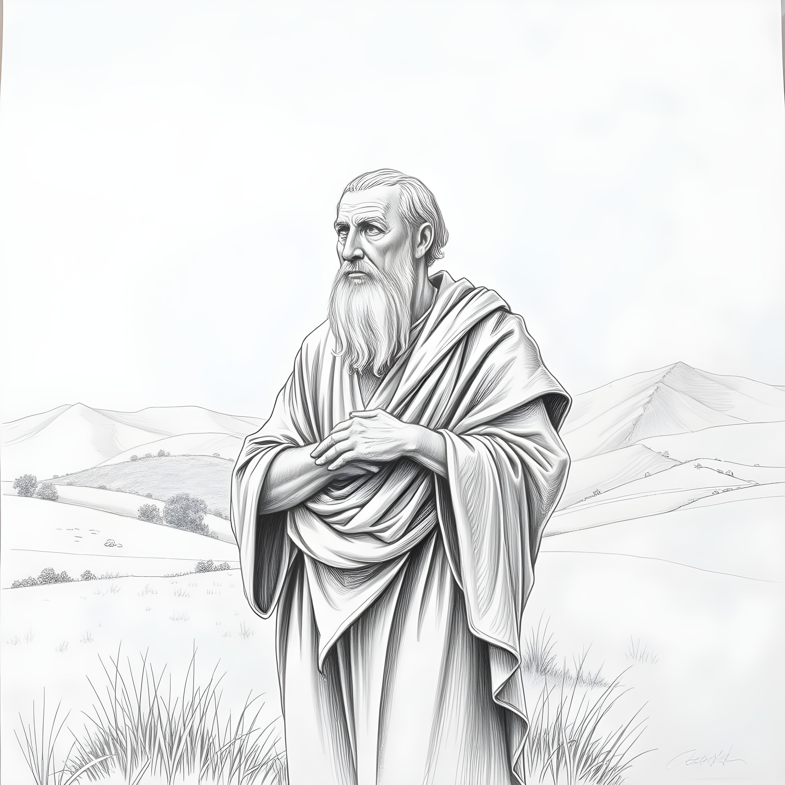

# Essentials of Moral Realism

This is a very short book on morality, what it is and what it means to us. Thought I hope to clarify a few things.

First, there are my friends who don't recognize a lawgiver for the universe, and therefor jump to the idea that morals are subjective.  Real morals truths exist without the need for a lawgiver.

Second, there are my friends who claim that morality can only come from an external lawgiver, and I hope to show that to be a hasty conclusion.  There are in fact mechanisms in the world that underly our moral behavior that have nothing to do with a lawgiver.

I have kept this as short and to the point as I can, but I give references to places where you can explore more on the topics.

Please enjoy.

